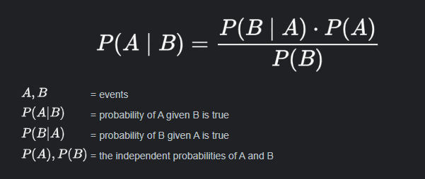

# Math and Logic Puzzles

## Math Concepts

    
Prime Number Law

- Every positive integer can be decomposed into a product of primes
- In order for a number `x` to divide a number `y`, `(y/x)` or `y%x = 0`,
 all primes in `x`'s prime factorization must be in `y`'s prime factorization

    
Sieve of Eratosthenes

- Highly efficient way to generate a list of primes
- It works by recognizing that all non-prime numbers are divisible by a prime number

## Probability

    
Bayes' Theorem

    
Independence

- If A and B are independent, then `P(A and B) = P(A) * P(B)`
- _If one event tells nothing about the other event._

    
Mutual Exclusivity

- If A and B are mutually exclusive, then `P(A or B) = P(A) + P(B)`
- and `P(A and B) = 0`
- _If one event occurs, then the other cannot occur._

