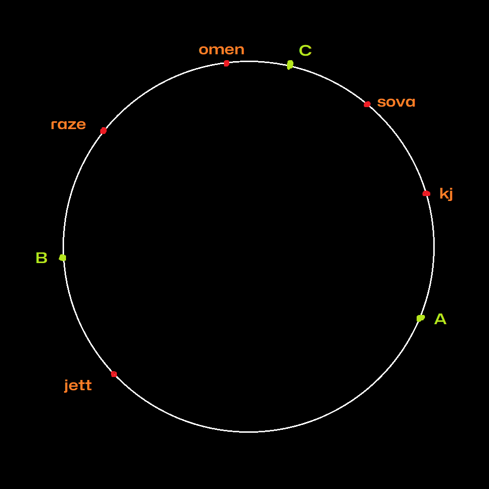
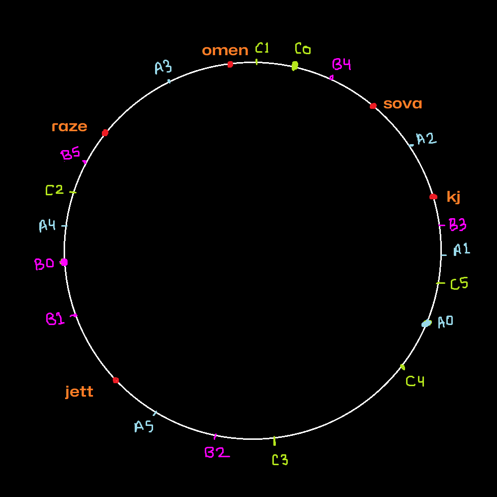

# Distributed Hashing

Splitting a hash table into several parts hosted by different servers.

## Why Distributed Hashing?
- To bypass the memory limitations of using a single computer, allowing for the construction of arbitrarily large hash tables (given enough servers) 
- The objects (and their keys) are distributed among several servers
- Example, Memcached
- **Most epic use case** - reduce load on a database server and improve performance

# Consistent Hashing
It is a distributed hashing scheme that operates independently of the number of servers or objects in a distributed hash table by assigning them a position on an abstract circle, or *hash-ring*

Example,
for the following data
| Key  | Hash | Angle (in °) |
|------|------|-------|
| sova |  79  |  56   |
| KJ   |  81  |  12   |
| raze | 101  |  127  |
| jett |  43  |  227  |
| omen |  21  |  96   |

Also, we have 3 servers: A, B and C, randomnly assigned angles to them
|Server|Angle (in °)|
|---|---|
|A|320|
|B|180|
|C|70|

Now, all of the keys which are closer to a server in the anti-clockwise direction, belong to that server. So,

|Key|Angle (in °)|Server it belongs to|
|---|---|---|
|sova|56|C|
|KJ|12|C|
|raze|127|B|
|jett|227|A|
|omen|96|B|

This is how keys can be distributed. But, how do we deal with rehashing when one of the servers is removed or a new one is added? Also, how to ensure even distribution of keys?

For that, instead of just one label of servers on the hash ring, we can put multiple labels for a server. For example, (*A0, A1, A2, A3 ... An*),

where *n* is an arbitrary number which is known as the **weight**. We'll discuss about the weight in a minute.

Let's say for all 3 servers, we have 6 labels (X0 to X5), all of them are interspersed along the circle.

Assigning all keys to their closest anti-clockwise label.

|Key|Angle (in °)|Label|Server|
|---|---|---|---|
|KJ|12|A2|A|
|sova|56|B4|B|
|omen|96|A3|A|
|raze|127|B5|B|
|jett|227|A5|A|

Now, lets say server B is removed, so all of the labels (B0 to B5) will be randomnly relabelled as Ax or Cx (reassigning them to servers A and C)

This method leaves rest of the keys untouched.

Similarly, if a new server is added, about 1/3rd of keys need to be remapped (D0 to D5).

So, in the worst case

*k/n* number of keys need to remapped

where 
- *k* = number of keys
- *n* = number of servers

## Implementation

Data stuctures to maintain,
1. List of labels, servers and keys (sorted in increasing order of angles)
2. List of key and their assigned label / server

## The Weight
It is the number of labels to make, it majorly depends on how powerful the server is.

Weight is basically the probability of which a server contains a key

Higher the weight -> Higher the probability of server containing a key

*If server is more powerful -> it can handle more requests/data -> increase its weight*