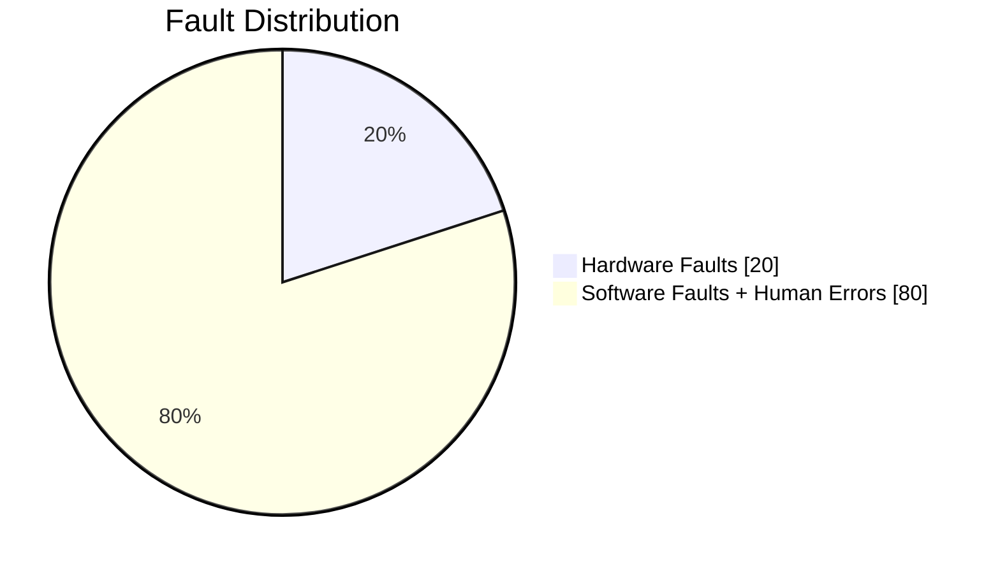

# Reliable, Scalable and Maintainable Systems

## Reliability
The system should continue to work *correctly* even in the face of *adversity*.
- Performing the correct function at the desired level of performance
- Tolerates user mistakes, unexpected usage of software
- Prevents any unauthorized access and abuse

There are mainly 3 types of faults that occur
1. Hardware Faults
    - Hard disks crash, faulty RAMs, power cuts, someone messes up the wiring
2. Software Faults
    - Bugs, runaway process, cascading failures
3. Human Errors
    - Wrong configuration

## How to make systems fault-tolerant?

- Hardware Faults
    - Add redundancy to systems
    - [RAID](https://en.wikipedia.org/wiki/RAID), dual power-supplies, hot-swappable CPUs, power backups
    - rolling-upgrades
- Software Faults
    - thorough testing
    - measuring, monitoring and analyzing system behavior in production 
- Human Errors
    - well-designed abstractions, APIs
    - provide sandbox environments
    - automated testing, setup [telemetry](https://en.wikipedia.org/wiki/Telemetry)
    - easy to rollback

---

## Scalability
System's ability to cope up with increased load.
### Describing Load
Load can be described using *load parameters*. Load parameters depends on your application. For example:
- requests per second to a web server
- reads to write ratio in a database
- cache hit rate
- number of simultaneous processes

**Fan-out** is a load parameter which is simply the number of requests to other services that we need to make in order to serve one incoming request. It is used in messaging systems/social media websites such as twitter.

### Describing Performance
Similar to load parameters, there are performance parameters.
- **Throughput**: number of requests processed per second
- **Response time**: the time between a client sending a request and receiving a response
- **Latency**: duration that a request is waiting to be handled - during which it is latent (awaiting service)
- **Percentiles**: percentile of requests by response time (p50 = median), for ex. p50, p95, p99, p999

2 questions that you need to ask

- How is the performance affected, when you increase the load, and keep the system resources unchanged ?
- How much resources need to be increased in order to keep the performance unchanged ?

## Vertical and Horizontal scaling
- **Vertical scaling**: moving to a more powerful machine
- **Horizontal scaling**: distributing the load across multiple smaller machines

Distributing load across multiple machines is also known as a *shared-nothing* architecture.

Good architectures involves a pragmatic mixture of the above 2 approaches.

---

## Maintainability
Majority of the cost of software is in its ongoing maintenance - 
- fixing bugs
- keeping its systems operational
- investigating failures
- adapting it to new platforms
- modifying it for new use-cases
- repaying technical debt
- adding new features

*Every legacy system is unpleasant in its own way, you just have to deal with it.*

But there are these 3 design principles that one should keep in mind while desiging a software
### **Operability**
Make it easy for operations teams to keep the system running smoothly
### **Simplicity**
Make it easy for new engineers to understand the system
### **Evolvability**
Make it easy for engineers to make changes to the system in the future. Also known as, modifiability, extensibility, or plasticity

Simplicity and Evolvability are highly dependent on the **low-level design** of a system.