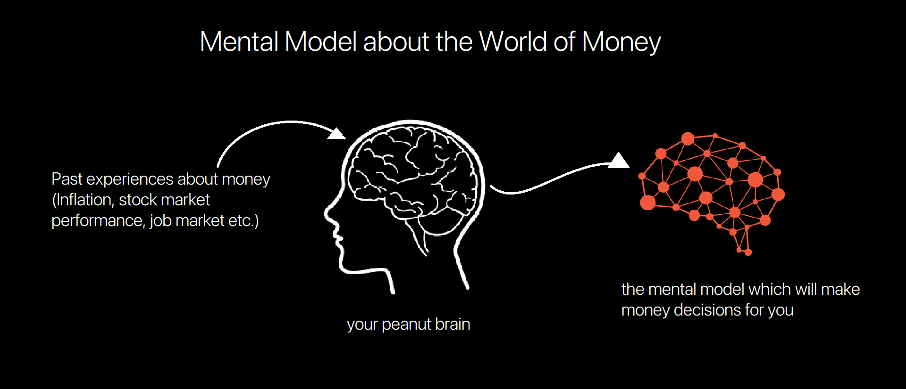

# No One's Crazy

*Your personal experiences with money make up maybe 0.00000001% of what's happened in the world, but maybe 80% of how you think the world works.*

---

Everyone has their own experiences with money. You know stuff about money that I don't and vice versa. You go through life with different beliefs, goals, and forecasts, than I do. That's not because one of us is smarter than the other, or has better information. It's because we've had different lives shaped by different and equally persuasive experiences.

Every decision people make with money is justified by taking the information they have at the moment and plugging it into their unique mental model of how the world works.

Their mental model could have been formed by misinformation, or persuasive marketing. They can also misjudge the consequences of their actions. But every financial decision a person makes, makes sense to them in that moment and checks the boxes they need to check.

With just around 20 to 50 years of experience in the modern financial system, there is no way to make right decisions everytime.

For a topic that is so influenced by emotion versus fact, this is a problem. And it helps explain why we don't always do what we're supposed to with money. We all make decisions based on our own unique experiences that seem to make sense to us in a given moment. No one's crazy.